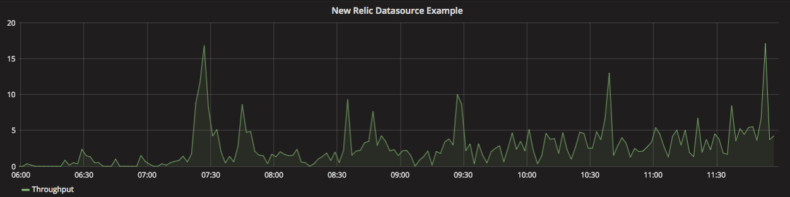
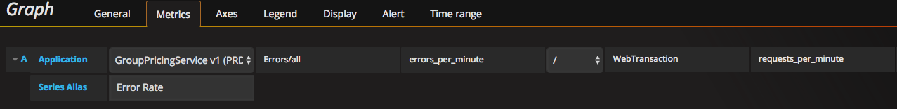
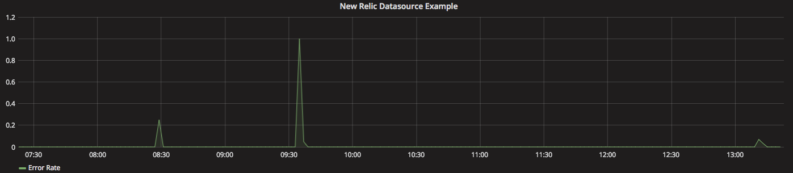
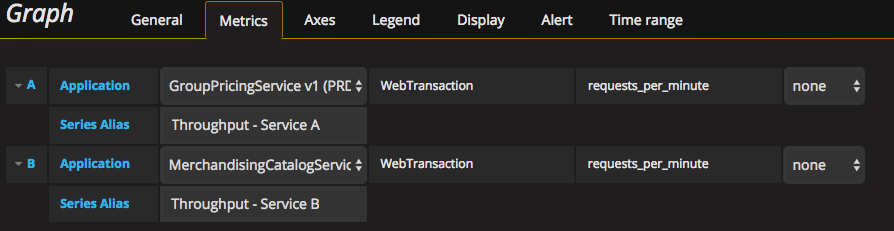
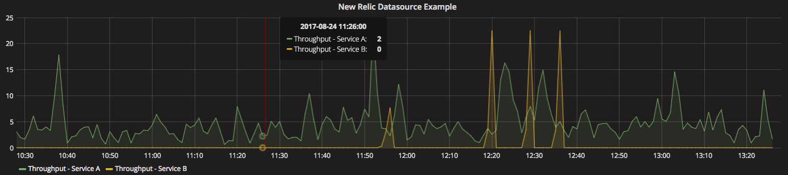

# New Relic Datasource - Custom Grafana Plugin
You can use New Relic Datasource plugin to integrate New Relic metrics into Grafana using New Relic APM API. 

## Supported Grafana versions
Grafana version 3.0.0-beta7 and 3.0.1 stable and higher.

## Adding the data source to Grafana

1. Add the contents of this repository to your grafana plugins directory and then restart the grafana server.
- Plugin directory: 
  - /var/lib/grafana/plugins (default)
  - /usr/local/var/lib/grafana/plugins (if installed with brew on mac)

2. Open the side menu by clicking the Grafana icon in the top header and select *Data Sources*.

3. Click the *+ Add data source* button in the top header.

4. Select *NewRelic* from the Type dropdown.

5. Enter the datasource *Name* and *API Key* that can be found New Relic account settings under Integrations->API Keys.

## Query editor
Open a graph in edit mode by click the *Title > Edit* (or by pressing *e* key while hovering over panel).

### Adding single metric to a graph
- Select *Application*, *Metric Namespace*, and *Metric Value* from the dropdown lists.
- Set the operator to *none*.
- Provide *Series Alias* if needed. If left blank, series will be aliased as "MetricNamespace:MetricValue". MetricValue can be accessed as $value when defining the alias. 

- The query outputs a graph.

### Adding an expression based on 2 metrics to a graph
- Select *Application*, *Metric Namespace*, and *Metric Value* from the dropdown lists.
- Choose the *Operator*. 4 operators are supported (+, -, *, /).
- Select *Metric Namespace*, and *Metric Value* for the 2nd operand from the dropdown lists.
- Provide *Series Alias* if needed.

- The query outputs a graph.

### Adding multiple series to a graph
- Add more metrics to the graph by adding another query in the panel editor. Provide meaningful aliases for clarity.

- The graph will have both metrics superimposed.

- Use *Mixed* datasource if you're trying to superimpose metrics from different datasources.

## A note on large result sets from New Relic
New Relic APIs, by default, return 200 results (see https://docs.newrelic.com/docs/apis/rest-api-v2/requirements/pagination-api-output). Paging has been added to the query for Applications, with an arbitrary limit hardcoded at 10 pages.
- The hardcoded limit is arbitrary. If you need more than 2000 results (200 per page over 10 pages), increasing the *finalPageNumber* default value in *NewRelicQueryCtrl.prototype.getApplications* is all that would need to be done.
- Although paging has been implemented for Applications, the same can not yet be said for Metrics. This means that Metrics are currently limited to 200 results maximum.

